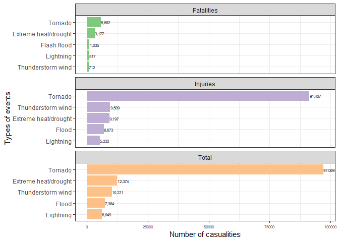
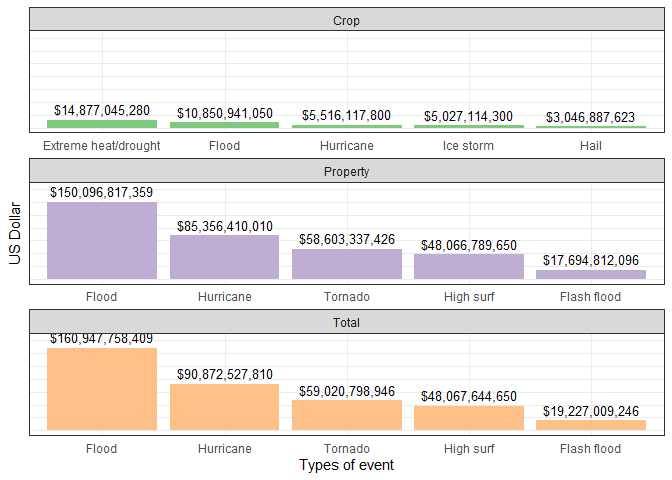

## Synopsis

Storms and other severe weather events have significant impacts on population health and economy. From the database of **National Oceanic & Atmospheric Administration**, I downloaded the data between 1950 and 2011 using the following link: [storm-dataset](https://d396qusza40orc.cloudfront.net/repdata%2Fdata%2FStormData.csv.bz2). The documentation of the data can also be found [here](https://d396qusza40orc.cloudfront.net/repdata%2Fpeer2_doc%2Fpd01016005curr.pdf). Using this data, I examine which type of *storms or severe weather events* are causing the most *damage to population health and economy*.

## Data processing

**Due to the internet connection problem, I will not run some of the following lines to save the time rendering the pdf file.** In addition, the data documentation downloaded from R codes has error. Thus, I downloaded it manually and changed my codes as comment by adding "\#" so that my codes can be seen.

### Download and read the data


``` r
### URLs for download
# docURL <- "https://d396qusza40orc.cloudfront.net/repdata%2Fpeer2_doc%2Fpd01016005curr.pdf"
# dataURL <- "https://d396qusza40orc.cloudfront.net/repdata%2Fdata%2FStormData.csv.bz2"

### download the files (but not run due to unstable internet connection)
# download.file(url = docURL, destfile = "data-documentation.pdf",, method = "libcurl")
# download.file(url = dataURL, destfile = "storm-dataset.csv.bz2", method = "libcurl")

### read the data
data <- read.csv(bzfile("storm-dataset.csv.bz2"))
```

### Check the data structure


``` r
dim(data)
names(data)
head(data)
str(data)
```

The data set has 37 variables with 902,297 observations of storms or severe weather events. Here the columns required for the analysis are:

-   8."EVTYPE"
-   23.FATALITIES"
-   24."INJURIES"
-   25."PROPDMG"
-   26."PROPDMGEXP"
-   27."CROPDMG"
-   28."CROPDMGEXP"

These columns will be selected as a subset before the data analysis. Property damage exponent ("PROPDMGEXP") and crop damage exponent ("CROPDMGEXP") need to be changed to numerical values.

### Data preparation for analysis

Load the libraries required


``` r
loadLib <- function(package) {
    if(!require(package, character.only = T)){
        install.packages(package, character.only = T)
        library(package, character.only = T, mask.ok = c("filter","lag"))
    } else {
        print(paste(package, "already installed"))
    }
}

sapply(c("tidyverse", "stringr", "finalfit"), loadLib)
```

First, the columns required are selected.


``` r
df <- data %>% 
    select(c("EVTYPE","FATALITIES","INJURIES","PROPDMG","PROPDMGEXP","CROPDMG","CROPDMGEXP"))
head(df)
```

```
##    EVTYPE FATALITIES INJURIES PROPDMG PROPDMGEXP CROPDMG CROPDMGEXP
## 1 TORNADO          0       15    25.0          K       0           
## 2 TORNADO          0        0     2.5          K       0           
## 3 TORNADO          0        2    25.0          K       0           
## 4 TORNADO          0        2     2.5          K       0           
## 5 TORNADO          0        2     2.5          K       0           
## 6 TORNADO          0        6     2.5          K       0
```

Now check the EVTYPES.


``` r
with(df, sort(unique(EVTYPE)))
```

```
##   [1] "   HIGH SURF ADVISORY"          " COASTAL FLOOD"                
##   [3] " FLASH FLOOD"                   " LIGHTNING"                    
##   [5] " TSTM WIND"                     " TSTM WIND (G45)"              
##   [7] " WATERSPOUT"                    " WIND"                         
##   [9] "?"                              "ABNORMAL WARMTH"               
##  [11] "ABNORMALLY DRY"                 "ABNORMALLY WET"                
##  [13] "ACCUMULATED SNOWFALL"           "AGRICULTURAL FREEZE"           
##  [15] "APACHE COUNTY"                  "ASTRONOMICAL HIGH TIDE"        
##  [17] "ASTRONOMICAL LOW TIDE"          "AVALANCE"                      
##  [19] "AVALANCHE"                      "BEACH EROSIN"                  
##  [21] "Beach Erosion"                  "BEACH EROSION"                 
##  [23] "BEACH EROSION/COASTAL FLOOD"    "BEACH FLOOD"                   
##  [25] "BELOW NORMAL PRECIPITATION"     "BITTER WIND CHILL"             
##  [27] "BITTER WIND CHILL TEMPERATURES" "Black Ice"                     
##  [29] "BLACK ICE"                      "BLIZZARD"                      
##  [31] "BLIZZARD AND EXTREME WIND CHIL" "BLIZZARD AND HEAVY SNOW"       
##  [33] "Blizzard Summary"               "BLIZZARD WEATHER"              
##  [35] "BLIZZARD/FREEZING RAIN"         "BLIZZARD/HEAVY SNOW"           
##  [37] "BLIZZARD/HIGH WIND"             "BLIZZARD/WINTER STORM"         
##  [39] "BLOW-OUT TIDE"                  "BLOW-OUT TIDES"                
##  [41] "BLOWING DUST"                   "blowing snow"                  
##  [43] "Blowing Snow"                   "BLOWING SNOW"                  
##  [45] "BLOWING SNOW- EXTREME WIND CHI" "BLOWING SNOW & EXTREME WIND CH"
##  [47] "BLOWING SNOW/EXTREME WIND CHIL" "BREAKUP FLOODING"              
##  [49] "BRUSH FIRE"                     "BRUSH FIRES"                   
##  [51] "COASTAL  FLOODING/EROSION"      "COASTAL EROSION"               
##  [53] "Coastal Flood"                  "COASTAL FLOOD"                 
##  [55] "coastal flooding"               "Coastal Flooding"              
##  [57] "COASTAL FLOODING"               "COASTAL FLOODING/EROSION"      
##  [59] "Coastal Storm"                  "COASTAL STORM"                 
##  [61] "COASTAL SURGE"                  "COASTAL/TIDAL FLOOD"           
##  [63] "COASTALFLOOD"                   "COASTALSTORM"                  
##  [65] "Cold"                           "COLD"                          
##  [67] "COLD AIR FUNNEL"                "COLD AIR FUNNELS"              
##  [69] "COLD AIR TORNADO"               "Cold and Frost"                
##  [71] "COLD AND FROST"                 "COLD AND SNOW"                 
##  [73] "COLD AND WET CONDITIONS"        "Cold Temperature"              
##  [75] "COLD TEMPERATURES"              "COLD WAVE"                     
##  [77] "COLD WEATHER"                   "COLD WIND CHILL TEMPERATURES"  
##  [79] "COLD/WIND CHILL"                "COLD/WINDS"                    
##  [81] "COOL AND WET"                   "COOL SPELL"                    
##  [83] "CSTL FLOODING/EROSION"          "DAM BREAK"                     
##  [85] "DAM FAILURE"                    "Damaging Freeze"               
##  [87] "DAMAGING FREEZE"                "DEEP HAIL"                     
##  [89] "DENSE FOG"                      "DENSE SMOKE"                   
##  [91] "DOWNBURST"                      "DOWNBURST WINDS"               
##  [93] "DRIEST MONTH"                   "Drifting Snow"                 
##  [95] "DROUGHT"                        "DROUGHT/EXCESSIVE HEAT"        
##  [97] "DROWNING"                       "DRY"                           
##  [99] "DRY CONDITIONS"                 "DRY HOT WEATHER"               
## [101] "DRY MICROBURST"                 "DRY MICROBURST 50"             
## [103] "DRY MICROBURST 53"              "DRY MICROBURST 58"             
## [105] "DRY MICROBURST 61"              "DRY MICROBURST 84"             
## [107] "DRY MICROBURST WINDS"           "DRY MIRCOBURST WINDS"          
## [109] "DRY PATTERN"                    "DRY SPELL"                     
## [111] "DRY WEATHER"                    "DRYNESS"                       
## [113] "DUST DEVEL"                     "Dust Devil"                    
## [115] "DUST DEVIL"                     "DUST DEVIL WATERSPOUT"         
## [117] "DUST STORM"                     "DUST STORM/HIGH WINDS"         
## [119] "DUSTSTORM"                      "EARLY FREEZE"                  
## [121] "Early Frost"                    "EARLY FROST"                   
## [123] "EARLY RAIN"                     "EARLY SNOW"                    
## [125] "Early snowfall"                 "EARLY SNOWFALL"                
## [127] "Erosion/Cstl Flood"             "EXCESSIVE"                     
## [129] "Excessive Cold"                 "EXCESSIVE HEAT"                
## [131] "EXCESSIVE HEAT/DROUGHT"         "EXCESSIVE PRECIPITATION"       
## [133] "EXCESSIVE RAIN"                 "EXCESSIVE RAINFALL"            
## [135] "EXCESSIVE SNOW"                 "EXCESSIVE WETNESS"             
## [137] "EXCESSIVELY DRY"                "Extended Cold"                 
## [139] "Extreme Cold"                   "EXTREME COLD"                  
## [141] "EXTREME COLD/WIND CHILL"        "EXTREME HEAT"                  
## [143] "EXTREME WIND CHILL"             "EXTREME WIND CHILL/BLOWING SNO"
## [145] "EXTREME WIND CHILLS"            "EXTREME WINDCHILL"             
## [147] "EXTREME WINDCHILL TEMPERATURES" "EXTREME/RECORD COLD"           
## [149] "EXTREMELY WET"                  "FALLING SNOW/ICE"              
## [151] "FIRST FROST"                    "FIRST SNOW"                    
## [153] "FLASH FLOOD"                    "FLASH FLOOD - HEAVY RAIN"      
## [155] "FLASH FLOOD FROM ICE JAMS"      "FLASH FLOOD LANDSLIDES"        
## [157] "FLASH FLOOD WINDS"              "FLASH FLOOD/"                  
## [159] "FLASH FLOOD/ FLOOD"             "FLASH FLOOD/ STREET"           
## [161] "FLASH FLOOD/FLOOD"              "FLASH FLOOD/HEAVY RAIN"        
## [163] "FLASH FLOOD/LANDSLIDE"          "FLASH FLOODING"                
## [165] "FLASH FLOODING/FLOOD"           "FLASH FLOODING/THUNDERSTORM WI"
## [167] "FLASH FLOODS"                   "FLASH FLOOODING"               
## [169] "Flood"                          "FLOOD"                         
## [171] "FLOOD & HEAVY RAIN"             "FLOOD FLASH"                   
## [173] "FLOOD FLOOD/FLASH"              "FLOOD WATCH/"                  
## [175] "FLOOD/FLASH"                    "Flood/Flash Flood"             
## [177] "FLOOD/FLASH FLOOD"              "FLOOD/FLASH FLOODING"          
## [179] "FLOOD/FLASH/FLOOD"              "FLOOD/FLASHFLOOD"              
## [181] "FLOOD/RAIN/WIND"                "FLOOD/RAIN/WINDS"              
## [183] "FLOOD/RIVER FLOOD"              "Flood/Strong Wind"             
## [185] "FLOODING"                       "FLOODING/HEAVY RAIN"           
## [187] "FLOODS"                         "FOG"                           
## [189] "FOG AND COLD TEMPERATURES"      "FOREST FIRES"                  
## [191] "Freeze"                         "FREEZE"                        
## [193] "Freezing drizzle"               "Freezing Drizzle"              
## [195] "FREEZING DRIZZLE"               "FREEZING DRIZZLE AND FREEZING" 
## [197] "Freezing Fog"                   "FREEZING FOG"                  
## [199] "Freezing rain"                  "Freezing Rain"                 
## [201] "FREEZING RAIN"                  "FREEZING RAIN AND SLEET"       
## [203] "FREEZING RAIN AND SNOW"         "FREEZING RAIN SLEET AND"       
## [205] "FREEZING RAIN SLEET AND LIGHT"  "FREEZING RAIN/SLEET"           
## [207] "FREEZING RAIN/SNOW"             "Freezing Spray"                
## [209] "Frost"                          "FROST"                         
## [211] "Frost/Freeze"                   "FROST/FREEZE"                  
## [213] "FROST\\FREEZE"                  "FUNNEL"                        
## [215] "Funnel Cloud"                   "FUNNEL CLOUD"                  
## [217] "FUNNEL CLOUD."                  "FUNNEL CLOUD/HAIL"             
## [219] "FUNNEL CLOUDS"                  "FUNNELS"                       
## [221] "Glaze"                          "GLAZE"                         
## [223] "GLAZE ICE"                      "GLAZE/ICE STORM"               
## [225] "gradient wind"                  "Gradient wind"                 
## [227] "GRADIENT WIND"                  "GRADIENT WINDS"                
## [229] "GRASS FIRES"                    "GROUND BLIZZARD"               
## [231] "GUSTNADO"                       "GUSTNADO AND"                  
## [233] "GUSTY LAKE WIND"                "GUSTY THUNDERSTORM WIND"       
## [235] "GUSTY THUNDERSTORM WINDS"       "Gusty Wind"                    
## [237] "GUSTY WIND"                     "GUSTY WIND/HAIL"               
## [239] "GUSTY WIND/HVY RAIN"            "Gusty wind/rain"               
## [241] "Gusty winds"                    "Gusty Winds"                   
## [243] "GUSTY WINDS"                    "HAIL"                          
## [245] "HAIL 0.75"                      "HAIL 0.88"                     
## [247] "HAIL 075"                       "HAIL 088"                      
## [249] "HAIL 1.00"                      "HAIL 1.75"                     
## [251] "HAIL 1.75)"                     "HAIL 100"                      
## [253] "HAIL 125"                       "HAIL 150"                      
## [255] "HAIL 175"                       "HAIL 200"                      
## [257] "HAIL 225"                       "HAIL 275"                      
## [259] "HAIL 450"                       "HAIL 75"                       
## [261] "HAIL 80"                        "HAIL 88"                       
## [263] "HAIL ALOFT"                     "HAIL DAMAGE"                   
## [265] "HAIL FLOODING"                  "HAIL STORM"                    
## [267] "Hail(0.75)"                     "HAIL/ICY ROADS"                
## [269] "HAIL/WIND"                      "HAIL/WINDS"                    
## [271] "HAILSTORM"                      "HAILSTORMS"                    
## [273] "HARD FREEZE"                    "HAZARDOUS SURF"                
## [275] "HEAT"                           "HEAT DROUGHT"                  
## [277] "Heat Wave"                      "HEAT WAVE"                     
## [279] "HEAT WAVE DROUGHT"              "HEAT WAVES"                    
## [281] "HEAT/DROUGHT"                   "Heatburst"                     
## [283] "HEAVY LAKE SNOW"                "HEAVY MIX"                     
## [285] "HEAVY PRECIPATATION"            "Heavy Precipitation"           
## [287] "HEAVY PRECIPITATION"            "Heavy rain"                    
## [289] "Heavy Rain"                     "HEAVY RAIN"                    
## [291] "HEAVY RAIN AND FLOOD"           "Heavy Rain and Wind"           
## [293] "HEAVY RAIN EFFECTS"             "HEAVY RAIN/FLOODING"           
## [295] "Heavy Rain/High Surf"           "HEAVY RAIN/LIGHTNING"          
## [297] "HEAVY RAIN/MUDSLIDES/FLOOD"     "HEAVY RAIN/SEVERE WEATHER"     
## [299] "HEAVY RAIN/SMALL STREAM URBAN"  "HEAVY RAIN/SNOW"               
## [301] "HEAVY RAIN/URBAN FLOOD"         "HEAVY RAIN/WIND"               
## [303] "HEAVY RAIN; URBAN FLOOD WINDS;" "HEAVY RAINFALL"                
## [305] "HEAVY RAINS"                    "HEAVY RAINS/FLOODING"          
## [307] "HEAVY SEAS"                     "HEAVY SHOWER"                  
## [309] "HEAVY SHOWERS"                  "HEAVY SNOW"                    
## [311] "HEAVY SNOW-SQUALLS"             "HEAVY SNOW   FREEZING RAIN"    
## [313] "HEAVY SNOW & ICE"               "HEAVY SNOW AND"                
## [315] "HEAVY SNOW AND HIGH WINDS"      "HEAVY SNOW AND ICE"            
## [317] "HEAVY SNOW AND ICE STORM"       "HEAVY SNOW AND STRONG WINDS"   
## [319] "HEAVY SNOW ANDBLOWING SNOW"     "Heavy snow shower"             
## [321] "HEAVY SNOW SQUALLS"             "HEAVY SNOW/BLIZZARD"           
## [323] "HEAVY SNOW/BLIZZARD/AVALANCHE"  "HEAVY SNOW/BLOWING SNOW"       
## [325] "HEAVY SNOW/FREEZING RAIN"       "HEAVY SNOW/HIGH"               
## [327] "HEAVY SNOW/HIGH WIND"           "HEAVY SNOW/HIGH WINDS"         
## [329] "HEAVY SNOW/HIGH WINDS & FLOOD"  "HEAVY SNOW/HIGH WINDS/FREEZING"
## [331] "HEAVY SNOW/ICE"                 "HEAVY SNOW/ICE STORM"          
## [333] "HEAVY SNOW/SLEET"               "HEAVY SNOW/SQUALLS"            
## [335] "HEAVY SNOW/WIND"                "HEAVY SNOW/WINTER STORM"       
## [337] "HEAVY SNOWPACK"                 "Heavy Surf"                    
## [339] "HEAVY SURF"                     "Heavy surf and wind"           
## [341] "HEAVY SURF COASTAL FLOODING"    "HEAVY SURF/HIGH SURF"          
## [343] "HEAVY SWELLS"                   "HEAVY WET SNOW"                
## [345] "HIGH"                           "HIGH  SWELLS"                  
## [347] "HIGH  WINDS"                    "HIGH SEAS"                     
## [349] "High Surf"                      "HIGH SURF"                     
## [351] "HIGH SURF ADVISORIES"           "HIGH SURF ADVISORY"            
## [353] "HIGH SWELLS"                    "HIGH TEMPERATURE RECORD"       
## [355] "HIGH TIDES"                     "HIGH WATER"                    
## [357] "HIGH WAVES"                     "High Wind"                     
## [359] "HIGH WIND"                      "HIGH WIND (G40)"               
## [361] "HIGH WIND 48"                   "HIGH WIND 63"                  
## [363] "HIGH WIND 70"                   "HIGH WIND AND HEAVY SNOW"      
## [365] "HIGH WIND AND HIGH TIDES"       "HIGH WIND AND SEAS"            
## [367] "HIGH WIND DAMAGE"               "HIGH WIND/ BLIZZARD"           
## [369] "HIGH WIND/BLIZZARD"             "HIGH WIND/BLIZZARD/FREEZING RA"
## [371] "HIGH WIND/HEAVY SNOW"           "HIGH WIND/LOW WIND CHILL"      
## [373] "HIGH WIND/SEAS"                 "HIGH WIND/WIND CHILL"          
## [375] "HIGH WIND/WIND CHILL/BLIZZARD"  "HIGH WINDS"                    
## [377] "HIGH WINDS 55"                  "HIGH WINDS 57"                 
## [379] "HIGH WINDS 58"                  "HIGH WINDS 63"                 
## [381] "HIGH WINDS 66"                  "HIGH WINDS 67"                 
## [383] "HIGH WINDS 73"                  "HIGH WINDS 76"                 
## [385] "HIGH WINDS 80"                  "HIGH WINDS 82"                 
## [387] "HIGH WINDS AND WIND CHILL"      "HIGH WINDS DUST STORM"         
## [389] "HIGH WINDS HEAVY RAINS"         "HIGH WINDS/"                   
## [391] "HIGH WINDS/COASTAL FLOOD"       "HIGH WINDS/COLD"               
## [393] "HIGH WINDS/FLOODING"            "HIGH WINDS/HEAVY RAIN"         
## [395] "HIGH WINDS/SNOW"                "HIGHWAY FLOODING"              
## [397] "Hot and Dry"                    "HOT PATTERN"                   
## [399] "HOT SPELL"                      "HOT WEATHER"                   
## [401] "HOT/DRY PATTERN"                "HURRICANE"                     
## [403] "HURRICANE-GENERATED SWELLS"     "Hurricane Edouard"             
## [405] "HURRICANE EMILY"                "HURRICANE ERIN"                
## [407] "HURRICANE FELIX"                "HURRICANE GORDON"              
## [409] "HURRICANE OPAL"                 "HURRICANE OPAL/HIGH WINDS"     
## [411] "HURRICANE/TYPHOON"              "HVY RAIN"                      
## [413] "HYPERTHERMIA/EXPOSURE"          "HYPOTHERMIA"                   
## [415] "Hypothermia/Exposure"           "HYPOTHERMIA/EXPOSURE"          
## [417] "ICE"                            "ICE AND SNOW"                  
## [419] "ICE FLOES"                      "Ice Fog"                       
## [421] "ICE JAM"                        "Ice jam flood (minor"          
## [423] "ICE JAM FLOODING"               "ICE ON ROAD"                   
## [425] "ICE PELLETS"                    "ICE ROADS"                     
## [427] "ICE STORM"                      "ICE STORM AND SNOW"            
## [429] "ICE STORM/FLASH FLOOD"          "Ice/Snow"                      
## [431] "ICE/SNOW"                       "ICE/STRONG WINDS"              
## [433] "Icestorm/Blizzard"              "Icy Roads"                     
## [435] "ICY ROADS"                      "LACK OF SNOW"                  
## [437] "LAKE-EFFECT SNOW"               "Lake Effect Snow"              
## [439] "LAKE EFFECT SNOW"               "LAKE FLOOD"                    
## [441] "LAKESHORE FLOOD"                "LANDSLIDE"                     
## [443] "LANDSLIDE/URBAN FLOOD"          "LANDSLIDES"                    
## [445] "Landslump"                      "LANDSLUMP"                     
## [447] "LANDSPOUT"                      "LARGE WALL CLOUD"              
## [449] "Late-season Snowfall"           "LATE FREEZE"                   
## [451] "LATE SEASON HAIL"               "LATE SEASON SNOW"              
## [453] "Late Season Snowfall"           "LATE SNOW"                     
## [455] "LIGHT FREEZING RAIN"            "Light snow"                    
## [457] "Light Snow"                     "LIGHT SNOW"                    
## [459] "LIGHT SNOW AND SLEET"           "Light Snow/Flurries"           
## [461] "LIGHT SNOW/FREEZING PRECIP"     "Light Snowfall"                
## [463] "LIGHTING"                       "LIGHTNING"                     
## [465] "LIGHTNING  WAUSEON"             "LIGHTNING AND HEAVY RAIN"      
## [467] "LIGHTNING AND THUNDERSTORM WIN" "LIGHTNING AND WINDS"           
## [469] "LIGHTNING DAMAGE"               "LIGHTNING FIRE"                
## [471] "LIGHTNING INJURY"               "LIGHTNING THUNDERSTORM WINDS"  
## [473] "LIGHTNING THUNDERSTORM WINDSS"  "LIGHTNING."                    
## [475] "LIGHTNING/HEAVY RAIN"           "LIGNTNING"                     
## [477] "LOCAL FLASH FLOOD"              "LOCAL FLOOD"                   
## [479] "LOCALLY HEAVY RAIN"             "LOW TEMPERATURE"               
## [481] "LOW TEMPERATURE RECORD"         "LOW WIND CHILL"                
## [483] "MAJOR FLOOD"                    "Marine Accident"               
## [485] "MARINE HAIL"                    "MARINE HIGH WIND"              
## [487] "MARINE MISHAP"                  "MARINE STRONG WIND"            
## [489] "MARINE THUNDERSTORM WIND"       "MARINE TSTM WIND"              
## [491] "Metro Storm, May 26"            "Microburst"                    
## [493] "MICROBURST"                     "MICROBURST WINDS"              
## [495] "Mild and Dry Pattern"           "MILD PATTERN"                  
## [497] "MILD/DRY PATTERN"               "MINOR FLOOD"                   
## [499] "Minor Flooding"                 "MINOR FLOODING"                
## [501] "MIXED PRECIP"                   "Mixed Precipitation"           
## [503] "MIXED PRECIPITATION"            "MODERATE SNOW"                 
## [505] "MODERATE SNOWFALL"              "MONTHLY PRECIPITATION"         
## [507] "Monthly Rainfall"               "MONTHLY RAINFALL"              
## [509] "Monthly Snowfall"               "MONTHLY SNOWFALL"              
## [511] "MONTHLY TEMPERATURE"            "Mountain Snows"                
## [513] "MUD SLIDE"                      "MUD SLIDES"                    
## [515] "MUD SLIDES URBAN FLOODING"      "MUD/ROCK SLIDE"                
## [517] "Mudslide"                       "MUDSLIDE"                      
## [519] "MUDSLIDE/LANDSLIDE"             "Mudslides"                     
## [521] "MUDSLIDES"                      "NEAR RECORD SNOW"              
## [523] "No Severe Weather"              "NON-SEVERE WIND DAMAGE"        
## [525] "NON-TSTM WIND"                  "NON SEVERE HAIL"               
## [527] "NON TSTM WIND"                  "NONE"                          
## [529] "NORMAL PRECIPITATION"           "NORTHERN LIGHTS"               
## [531] "Other"                          "OTHER"                         
## [533] "PATCHY DENSE FOG"               "PATCHY ICE"                    
## [535] "Prolong Cold"                   "PROLONG COLD"                  
## [537] "PROLONG COLD/SNOW"              "PROLONG WARMTH"                
## [539] "PROLONGED RAIN"                 "RAIN"                          
## [541] "RAIN (HEAVY)"                   "RAIN AND WIND"                 
## [543] "Rain Damage"                    "RAIN/SNOW"                     
## [545] "RAIN/WIND"                      "RAINSTORM"                     
## [547] "RAPIDLY RISING WATER"           "RECORD  COLD"                  
## [549] "Record Cold"                    "RECORD COLD"                   
## [551] "RECORD COLD AND HIGH WIND"      "RECORD COLD/FROST"             
## [553] "RECORD COOL"                    "Record dry month"              
## [555] "RECORD DRYNESS"                 "Record Heat"                   
## [557] "RECORD HEAT"                    "RECORD HEAT WAVE"              
## [559] "Record High"                    "RECORD HIGH"                   
## [561] "RECORD HIGH TEMPERATURE"        "RECORD HIGH TEMPERATURES"      
## [563] "RECORD LOW"                     "RECORD LOW RAINFALL"           
## [565] "Record May Snow"                "RECORD PRECIPITATION"          
## [567] "RECORD RAINFALL"                "RECORD SNOW"                   
## [569] "RECORD SNOW/COLD"               "RECORD SNOWFALL"               
## [571] "Record temperature"             "RECORD TEMPERATURE"            
## [573] "Record Temperatures"            "RECORD TEMPERATURES"           
## [575] "RECORD WARM"                    "RECORD WARM TEMPS."            
## [577] "Record Warmth"                  "RECORD WARMTH"                 
## [579] "Record Winter Snow"             "RECORD/EXCESSIVE HEAT"         
## [581] "RECORD/EXCESSIVE RAINFALL"      "RED FLAG CRITERIA"             
## [583] "RED FLAG FIRE WX"               "REMNANTS OF FLOYD"             
## [585] "RIP CURRENT"                    "RIP CURRENTS"                  
## [587] "RIP CURRENTS HEAVY SURF"        "RIP CURRENTS/HEAVY SURF"       
## [589] "RIVER AND STREAM FLOOD"         "RIVER FLOOD"                   
## [591] "River Flooding"                 "RIVER FLOODING"                
## [593] "ROCK SLIDE"                     "ROGUE WAVE"                    
## [595] "ROTATING WALL CLOUD"            "ROUGH SEAS"                    
## [597] "ROUGH SURF"                     "RURAL FLOOD"                   
## [599] "Saharan Dust"                   "SAHARAN DUST"                  
## [601] "Seasonal Snowfall"              "SEICHE"                        
## [603] "SEVERE COLD"                    "SEVERE THUNDERSTORM"           
## [605] "SEVERE THUNDERSTORM WINDS"      "SEVERE THUNDERSTORMS"          
## [607] "SEVERE TURBULENCE"              "SLEET"                         
## [609] "SLEET & FREEZING RAIN"          "SLEET STORM"                   
## [611] "SLEET/FREEZING RAIN"            "SLEET/ICE STORM"               
## [613] "SLEET/RAIN/SNOW"                "SLEET/SNOW"                    
## [615] "small hail"                     "Small Hail"                    
## [617] "SMALL HAIL"                     "SMALL STREAM"                  
## [619] "SMALL STREAM AND"               "SMALL STREAM AND URBAN FLOOD"  
## [621] "SMALL STREAM AND URBAN FLOODIN" "SMALL STREAM FLOOD"            
## [623] "SMALL STREAM FLOODING"          "SMALL STREAM URBAN FLOOD"      
## [625] "SMALL STREAM/URBAN FLOOD"       "Sml Stream Fld"                
## [627] "SMOKE"                          "Snow"                          
## [629] "SNOW"                           "SNOW- HIGH WIND- WIND CHILL"   
## [631] "Snow Accumulation"              "SNOW ACCUMULATION"             
## [633] "SNOW ADVISORY"                  "SNOW AND COLD"                 
## [635] "SNOW AND HEAVY SNOW"            "Snow and Ice"                  
## [637] "SNOW AND ICE"                   "SNOW AND ICE STORM"            
## [639] "Snow and sleet"                 "SNOW AND SLEET"                
## [641] "SNOW AND WIND"                  "SNOW DROUGHT"                  
## [643] "SNOW FREEZING RAIN"             "SNOW SHOWERS"                  
## [645] "SNOW SLEET"                     "SNOW SQUALL"                   
## [647] "Snow squalls"                   "Snow Squalls"                  
## [649] "SNOW SQUALLS"                   "SNOW/ BITTER COLD"             
## [651] "SNOW/ ICE"                      "SNOW/BLOWING SNOW"             
## [653] "SNOW/COLD"                      "SNOW/FREEZING RAIN"            
## [655] "SNOW/HEAVY SNOW"                "SNOW/HIGH WINDS"               
## [657] "SNOW/ICE"                       "SNOW/ICE STORM"                
## [659] "SNOW/RAIN"                      "SNOW/RAIN/SLEET"               
## [661] "SNOW/SLEET"                     "SNOW/SLEET/FREEZING RAIN"      
## [663] "SNOW/SLEET/RAIN"                "SNOW\\COLD"                    
## [665] "SNOWFALL RECORD"                "SNOWMELT FLOODING"             
## [667] "SNOWSTORM"                      "SOUTHEAST"                     
## [669] "STORM FORCE WINDS"              "STORM SURGE"                   
## [671] "STORM SURGE/TIDE"               "STREAM FLOODING"               
## [673] "STREET FLOOD"                   "STREET FLOODING"               
## [675] "Strong Wind"                    "STRONG WIND"                   
## [677] "STRONG WIND GUST"               "Strong winds"                  
## [679] "Strong Winds"                   "STRONG WINDS"                  
## [681] "Summary August 10"              "Summary August 11"             
## [683] "Summary August 17"              "Summary August 2-3"            
## [685] "Summary August 21"              "Summary August 28"             
## [687] "Summary August 4"               "Summary August 7"              
## [689] "Summary August 9"               "Summary Jan 17"                
## [691] "Summary July 23-24"             "Summary June 18-19"            
## [693] "Summary June 5-6"               "Summary June 6"                
## [695] "Summary of April 12"            "Summary of April 13"           
## [697] "Summary of April 21"            "Summary of April 27"           
## [699] "Summary of April 3rd"           "Summary of August 1"           
## [701] "Summary of July 11"             "Summary of July 2"             
## [703] "Summary of July 22"             "Summary of July 26"            
## [705] "Summary of July 29"             "Summary of July 3"             
## [707] "Summary of June 10"             "Summary of June 11"            
## [709] "Summary of June 12"             "Summary of June 13"            
## [711] "Summary of June 15"             "Summary of June 16"            
## [713] "Summary of June 18"             "Summary of June 23"            
## [715] "Summary of June 24"             "Summary of June 3"             
## [717] "Summary of June 30"             "Summary of June 4"             
## [719] "Summary of June 6"              "Summary of March 14"           
## [721] "Summary of March 23"            "Summary of March 24"           
## [723] "SUMMARY OF MARCH 24-25"         "SUMMARY OF MARCH 27"           
## [725] "SUMMARY OF MARCH 29"            "Summary of May 10"             
## [727] "Summary of May 13"              "Summary of May 14"             
## [729] "Summary of May 22"              "Summary of May 22 am"          
## [731] "Summary of May 22 pm"           "Summary of May 26 am"          
## [733] "Summary of May 26 pm"           "Summary of May 31 am"          
## [735] "Summary of May 31 pm"           "Summary of May 9-10"           
## [737] "Summary Sept. 25-26"            "Summary September 20"          
## [739] "Summary September 23"           "Summary September 3"           
## [741] "Summary September 4"            "Summary: Nov. 16"              
## [743] "Summary: Nov. 6-7"              "Summary: Oct. 20-21"           
## [745] "Summary: October 31"            "Summary: Sept. 18"             
## [747] "Temperature record"             "THUDERSTORM WINDS"             
## [749] "THUNDEERSTORM WINDS"            "THUNDERESTORM WINDS"           
## [751] "THUNDERSNOW"                    "Thundersnow shower"            
## [753] "THUNDERSTORM"                   "THUNDERSTORM  WINDS"           
## [755] "THUNDERSTORM DAMAGE"            "THUNDERSTORM DAMAGE TO"        
## [757] "THUNDERSTORM HAIL"              "THUNDERSTORM W INDS"           
## [759] "Thunderstorm Wind"              "THUNDERSTORM WIND"             
## [761] "THUNDERSTORM WIND (G40)"        "THUNDERSTORM WIND 50"          
## [763] "THUNDERSTORM WIND 52"           "THUNDERSTORM WIND 56"          
## [765] "THUNDERSTORM WIND 59"           "THUNDERSTORM WIND 59 MPH"      
## [767] "THUNDERSTORM WIND 59 MPH."      "THUNDERSTORM WIND 60 MPH"      
## [769] "THUNDERSTORM WIND 65 MPH"       "THUNDERSTORM WIND 65MPH"       
## [771] "THUNDERSTORM WIND 69"           "THUNDERSTORM WIND 98 MPH"      
## [773] "THUNDERSTORM WIND G50"          "THUNDERSTORM WIND G51"         
## [775] "THUNDERSTORM WIND G52"          "THUNDERSTORM WIND G55"         
## [777] "THUNDERSTORM WIND G60"          "THUNDERSTORM WIND G61"         
## [779] "THUNDERSTORM WIND TREES"        "THUNDERSTORM WIND."            
## [781] "THUNDERSTORM WIND/ TREE"        "THUNDERSTORM WIND/ TREES"      
## [783] "THUNDERSTORM WIND/AWNING"       "THUNDERSTORM WIND/HAIL"        
## [785] "THUNDERSTORM WIND/LIGHTNING"    "THUNDERSTORM WINDS"            
## [787] "THUNDERSTORM WINDS      LE CEN" "THUNDERSTORM WINDS 13"         
## [789] "THUNDERSTORM WINDS 2"           "THUNDERSTORM WINDS 50"         
## [791] "THUNDERSTORM WINDS 52"          "THUNDERSTORM WINDS 53"         
## [793] "THUNDERSTORM WINDS 60"          "THUNDERSTORM WINDS 61"         
## [795] "THUNDERSTORM WINDS 62"          "THUNDERSTORM WINDS 63 MPH"     
## [797] "THUNDERSTORM WINDS AND"         "THUNDERSTORM WINDS FUNNEL CLOU"
## [799] "THUNDERSTORM WINDS G"           "THUNDERSTORM WINDS G60"        
## [801] "THUNDERSTORM WINDS HAIL"        "THUNDERSTORM WINDS HEAVY RAIN" 
## [803] "THUNDERSTORM WINDS LIGHTNING"   "THUNDERSTORM WINDS SMALL STREA"
## [805] "THUNDERSTORM WINDS URBAN FLOOD" "THUNDERSTORM WINDS."           
## [807] "THUNDERSTORM WINDS/ FLOOD"      "THUNDERSTORM WINDS/ HAIL"      
## [809] "THUNDERSTORM WINDS/FLASH FLOOD" "THUNDERSTORM WINDS/FLOODING"   
## [811] "THUNDERSTORM WINDS/FUNNEL CLOU" "THUNDERSTORM WINDS/HAIL"       
## [813] "THUNDERSTORM WINDS/HEAVY RAIN"  "THUNDERSTORM WINDS53"          
## [815] "THUNDERSTORM WINDSHAIL"         "THUNDERSTORM WINDSS"           
## [817] "THUNDERSTORM WINS"              "THUNDERSTORMS"                 
## [819] "THUNDERSTORMS WIND"             "THUNDERSTORMS WINDS"           
## [821] "THUNDERSTORMW"                  "THUNDERSTORMW 50"              
## [823] "THUNDERSTORMW WINDS"            "THUNDERSTORMWINDS"             
## [825] "THUNDERSTROM WIND"              "THUNDERSTROM WINDS"            
## [827] "THUNDERTORM WINDS"              "THUNDERTSORM WIND"             
## [829] "THUNDESTORM WINDS"              "THUNERSTORM WINDS"             
## [831] "TIDAL FLOOD"                    "Tidal Flooding"                
## [833] "TIDAL FLOODING"                 "TORNADO"                       
## [835] "TORNADO DEBRIS"                 "TORNADO F0"                    
## [837] "TORNADO F1"                     "TORNADO F2"                    
## [839] "TORNADO F3"                     "TORNADO/WATERSPOUT"            
## [841] "TORNADOES"                      "TORNADOES, TSTM WIND, HAIL"    
## [843] "TORNADOS"                       "TORNDAO"                       
## [845] "TORRENTIAL RAIN"                "Torrential Rainfall"           
## [847] "TROPICAL DEPRESSION"            "TROPICAL STORM"                
## [849] "TROPICAL STORM ALBERTO"         "TROPICAL STORM DEAN"           
## [851] "TROPICAL STORM GORDON"          "TROPICAL STORM JERRY"          
## [853] "TSTM"                           "TSTM HEAVY RAIN"               
## [855] "Tstm Wind"                      "TSTM WIND"                     
## [857] "TSTM WIND  (G45)"               "TSTM WIND (41)"                
## [859] "TSTM WIND (G35)"                "TSTM WIND (G40)"               
## [861] "TSTM WIND (G45)"                "TSTM WIND 40"                  
## [863] "TSTM WIND 45"                   "TSTM WIND 50"                  
## [865] "TSTM WIND 51"                   "TSTM WIND 52"                  
## [867] "TSTM WIND 55"                   "TSTM WIND 65)"                 
## [869] "TSTM WIND AND LIGHTNING"        "TSTM WIND DAMAGE"              
## [871] "TSTM WIND G45"                  "TSTM WIND G58"                 
## [873] "TSTM WIND/HAIL"                 "TSTM WINDS"                    
## [875] "TSTM WND"                       "TSTMW"                         
## [877] "TSUNAMI"                        "TUNDERSTORM WIND"              
## [879] "TYPHOON"                        "Unseasonable Cold"             
## [881] "UNSEASONABLY COLD"              "UNSEASONABLY COOL"             
## [883] "UNSEASONABLY COOL & WET"        "UNSEASONABLY DRY"              
## [885] "UNSEASONABLY HOT"               "UNSEASONABLY WARM"             
## [887] "UNSEASONABLY WARM & WET"        "UNSEASONABLY WARM AND DRY"     
## [889] "UNSEASONABLY WARM YEAR"         "UNSEASONABLY WARM/WET"         
## [891] "UNSEASONABLY WET"               "UNSEASONAL LOW TEMP"           
## [893] "UNSEASONAL RAIN"                "UNUSUAL WARMTH"                
## [895] "UNUSUAL/RECORD WARMTH"          "UNUSUALLY COLD"                
## [897] "UNUSUALLY LATE SNOW"            "UNUSUALLY WARM"                
## [899] "URBAN AND SMALL"                "URBAN AND SMALL STREAM"        
## [901] "URBAN AND SMALL STREAM FLOOD"   "URBAN AND SMALL STREAM FLOODIN"
## [903] "Urban flood"                    "Urban Flood"                   
## [905] "URBAN FLOOD"                    "URBAN FLOOD LANDSLIDE"         
## [907] "Urban Flooding"                 "URBAN FLOODING"                
## [909] "URBAN FLOODS"                   "URBAN SMALL"                   
## [911] "URBAN SMALL STREAM FLOOD"       "URBAN/SMALL"                   
## [913] "URBAN/SMALL FLOODING"           "URBAN/SMALL STREAM"            
## [915] "URBAN/SMALL STREAM  FLOOD"      "URBAN/SMALL STREAM FLOOD"      
## [917] "URBAN/SMALL STREAM FLOODING"    "URBAN/SMALL STRM FLDG"         
## [919] "URBAN/SML STREAM FLD"           "URBAN/SML STREAM FLDG"         
## [921] "URBAN/STREET FLOODING"          "VERY DRY"                      
## [923] "VERY WARM"                      "VOG"                           
## [925] "Volcanic Ash"                   "VOLCANIC ASH"                  
## [927] "Volcanic Ash Plume"             "VOLCANIC ASHFALL"              
## [929] "VOLCANIC ERUPTION"              "WAKE LOW WIND"                 
## [931] "WALL CLOUD"                     "WALL CLOUD/FUNNEL CLOUD"       
## [933] "WARM DRY CONDITIONS"            "WARM WEATHER"                  
## [935] "WATER SPOUT"                    "WATERSPOUT"                    
## [937] "WATERSPOUT-"                    "WATERSPOUT-TORNADO"            
## [939] "WATERSPOUT FUNNEL CLOUD"        "WATERSPOUT TORNADO"            
## [941] "WATERSPOUT/"                    "WATERSPOUT/ TORNADO"           
## [943] "WATERSPOUT/TORNADO"             "WATERSPOUTS"                   
## [945] "WAYTERSPOUT"                    "wet micoburst"                 
## [947] "WET MICROBURST"                 "Wet Month"                     
## [949] "WET SNOW"                       "WET WEATHER"                   
## [951] "Wet Year"                       "Whirlwind"                     
## [953] "WHIRLWIND"                      "WILD FIRES"                    
## [955] "WILD/FOREST FIRE"               "WILD/FOREST FIRES"             
## [957] "WILDFIRE"                       "WILDFIRES"                     
## [959] "Wind"                           "WIND"                          
## [961] "WIND ADVISORY"                  "WIND AND WAVE"                 
## [963] "WIND CHILL"                     "WIND CHILL/HIGH WIND"          
## [965] "Wind Damage"                    "WIND DAMAGE"                   
## [967] "WIND GUSTS"                     "WIND STORM"                    
## [969] "WIND/HAIL"                      "WINDS"                         
## [971] "WINTER MIX"                     "WINTER STORM"                  
## [973] "WINTER STORM HIGH WINDS"        "WINTER STORM/HIGH WIND"        
## [975] "WINTER STORM/HIGH WINDS"        "WINTER STORMS"                 
## [977] "Winter Weather"                 "WINTER WEATHER"                
## [979] "WINTER WEATHER MIX"             "WINTER WEATHER/MIX"            
## [981] "WINTERY MIX"                    "Wintry mix"                    
## [983] "Wintry Mix"                     "WINTRY MIX"                    
## [985] "WND"
```

The event types "?" and those event with zero damage will be filtered.


``` r
df <- df %>% 
    filter(EVTYPE != "?" & (FATALITIES > 0 | INJURIES > 0 | PROPDMG > 0 | CROPDMG > 0))
```

After removing rows with zero damage, the summary were also removed instantly. Now the weather event will be regrouped. Before regrouping, white spaces were removed and letter cases were converted into upper cases.


``` r
df <- df %>% 
        mutate(
                ## To Upper Case
                EVTYPE = str_to_upper(EVTYPE),
                ## Remove white spaces
                EVTYPE = str_squish(EVTYPE))
```
  
#### Regrouping the event types
Some of the event types were due to typos and some were due to different use of words. So, I consulted with the [Storm Data Documentation](https://d396qusza40orc.cloudfront.net/repdata%2Fpeer2_doc%2Fpd01016005curr.pdf), and regrouped them as much as I could.


``` r
# regroup events
df <- df %>% 
        mutate(
                                   ## AVALANCHE
                EVTYPE = case_when(EVTYPE %in% c("AVALANCE","AVALANCHE") ~ "AVALANCHE",
                                   ## BLIZZARD
                                   EVTYPE %in% c("BLIZZARD","BLIZZARD/WINTER STORM",
                                                 "GROUND BLIZZARD") ~ "BLIZZARD",
                                   ## COASTAL FLOODING/ EROSION
                                   EVTYPE %in% c("COASTAL EROSION","COASTAL FLOOD",
                                                 "COASTAL FLOODING", 
                                                 "COASTAL FLOODING/EROSION",
                                                 "EROSION/CSTL FLOOD") ~ "COASTAL FLOODING/EROSION",
                                   ## COLD/ WINDCHILL (No tornado)
                                   EVTYPE %in% c("COLD",
                                                 "COLD AND SNOW",
                                                 "COLD AND WET CONDITIONS",
                                                 "COLD TEMPERATURE",
                                                 "COLD WAVE",
                                                 "COLD WEATHER",
                                                 "COLD/WIND CHILL",
                                                 "COLD/WINDS",
                                                 "COOL AND WET",
                                                 "RECORD COLD",
                                                 "UNSEASONABLE COLD",
                                                 "UNSEASONABLY COLD") ~ "COLD/WIND CHILL",
                                   ## EXTREME HEAT/DROUGHT
                                   EVTYPE %in% c("DROUGHT",
                                                 "DROUGHT/EXCESSIVE HEAT",
                                                 "HEAT WAVE DROUGHT",
                                                 "EXCESSIVE HEAT",
                                                 "EXTREME HEAT",
                                                 "HEAT",
                                                 "HEAT WAVE",
                                                 "HEAT WAVES",
                                                 "HYPERTHERMIA/EXPOSURE",
                                                 "RECORD/EXCESSIVE HEAT",
                                                 "UNSEASONABLY WARM",
                                                 "UNSEASONABLY WARM AND DRY",
                                                 "WARM WEATHER") ~ "EXTREME HEAT/DROUGHT",
                                   ## EXTREME COLD/WINDCHILL
                                   EVTYPE %in% c("EXTENDED COLD",
                                                 "EXTREME COLD",
                                                 "EXTREME COLD/WIND CHILL",
                                                 "EXTREME WIND CHILL",
                                                 "EXTREME WINDCHILL") ~ "EXTREME COLD/WIND CHILL",
                                   ## FLASH FLOOD
                                   EVTYPE %in% c("FLASH FLOOD",
                                                 "FLASH FLOOD - HEAVY RAIN",
                                                 "FLASH FLOOD FROM ICE JAMS",
                                                 "FLASH FLOOD LANDSLIDES",
                                                 "FLASH FLOOD WINDS",
                                                 "FLASH FLOOD/",
                                                 "FLASH FLOOD/ STREET",
                                                 "FLASH FLOOD/FLOOD",
                                                 "FLASH FLOOD/LANDSLIDE",
                                                 "FLASH FLOODING",
                                                 "FLASH FLOODING/FLOOD",
                                                 "FLASH FLOODING/THUNDERSTORM WI",
                                                 "FLASH FLOODS",
                                                 "FLOOD FLASH",
                                                 "FLOOD/FLASH",
                                                 "FLOOD/FLASH FLOOD",
                                                 "FLOOD/FLASH/FLOOD",
                                                 "FLOOD/FLASHFLOOD",
                                                 "MAJOR FLOOD") ~ "FLASH FLOOD",
                                   ## FLOOD
                                   EVTYPE %in% c("FLOOD",
                                                 "FLOOD/RAIN/WINDS",
                                                 "FLOOD/RIVER FLOOD",
                                                 "FLOODING",
                                                 "FLOODING/HEAVY RAIN",
                                                 "FLOODS",
                                                 "MINOR FLOODING",
                                                 "RIVER AND STREAM FLOOD",
                                                 "RIVER FLOOD",
                                                 "RIVER FLOODING",
                                                 "RURAL FLOOD",
                                                 "SMALL STREAM FLOOD",
                                                 "SNOWMELT FLOODING",
                                                 "URBAN AND SMALL",
                                                 "URBAN AND SMALL STREAM FLOODIN",
                                                 "URBAN FLOOD",
                                                 "URBAN FLOODING",
                                                 "URBAN FLOODS",
                                                 "URBAN SMALL",
                                                 "URBAN/SMALL STREAM",
                                                 "URBAN/SMALL STREAM FLOOD",
                                                 "URBAN/SML STREAM FLD") ~ "FLOOD",
                                   ## FREEZING FOG
                                   EVTYPE %in% c("FOG AND COLD TEMPERATURES",
                                                 "FREEZING FOG",
                                                 "FREEZING DRIZZLE",
                                                 "FREEZING RAIN",
                                                 "FREEZING RAIN/SLEET",
                                                 "FREEZING RAIN/SNOW",
                                                 "FREEZING SPRAY",
                                                 "LIGHT FREEZING RAIN")  ~ "FREEZING FOG",
                                   ## DENSE FOG
                                   EVTYPE %in% c("FOG", "DENSE FOG") ~ "DENSE FOG",
                                   ## FROST/FREEZE
                                   EVTYPE %in% c("FROST","FROST/FREEZE",
                                                 "FROST\\FREEZE",
                                                 "HARD FREEZE",
                                                 "AGRICULTURAL FREEZE") ~ "FROST/FREEZE",
                                   ## ICE STORM
                                   EVTYPE %in% c("GLAZE",
                                                 "GLAZE ICE",
                                                 "GLAZE/ICE STORM",
                                                 "ICE",
                                                 "ICE AND SNOW",
                                                 "ICE FLOES",
                                                 "ICE JAM",
                                                 "Ice JAM FLOOD (MINOR",
                                                 "ICE JAM FLOODING",
                                                 "ICE ON ROAD",
                                                 "ICE ROADS",
                                                 "ICE STORM",
                                                 "ICE STORM/FLASH FLOOD",
                                                 "ICE/STRONG WINDS",
                                                 "ICY ROADS",
                                                 "HYPOTHERMIA",
                                                 "HYPOTHERMIA/EXPOSURE",
                                                 "LOW TEMPERATURE") ~ "ICE STORM",
                                   ## HIGH WIND
                                   EVTYPE %in% c("HIGH WIND",
                                                 "HIGH WIND (G40)",
                                                 "HIGH WIND 48",
                                                 "HIGH WIND AND SEAS",
                                                 "HIGH WIND DAMAGE",
                                                 "HIGH WIND/BLIZZARD",
                                                 "HIGH WIND/HEAVY SNOW",
                                                 "HIGH WIND/SEAS",
                                                 "HIGH WINDS",
                                                 "HIGH WINDS HEAVY RAINS",
                                                 "HIGH WINDS/",
                                                 "HIGH WINDS/COASTAL FLOOD",
                                                 "HIGH WINDS/COLD",
                                                 "HIGH WINDS/HEAVY RAIN",
                                                 "HIGH WINDS/SNOW",
                                                 "NON-TSTM WIND",
                                                 "NON TSTM WIND",
                                                 "NON-SEVERE WIND DAMAGE",
                                                 "WINDS",
                                                 "WIND") ~ "HIGH WIND",
                                   ## STRONG WIND
                                   EVTYPE %in% c("GUSTY WIND",
                                                 "GUSTY WIND/HAIL",
                                                 "GUSTY WIND/HVY RAIN",
                                                 "GUSTY WIND/RAIN",
                                                 "GUSTY WINDS",
                                                 "STORM FORCE WINDS",
                                                 "STRONG WIND",
                                                 "STRONG WINDS",
                                                 "WIND AND WAVE",
                                                 "WIND DAMAGE",
                                                 "WIND STORM",
                                                 "WIND/HAIL") ~ "STRONG WIND",
                                   ## HAIL
                                   EVTYPE %in% c("HAIL",
                                                 "HAIL 0.75",
                                                 "HAIL 075",
                                                 "HAIL 100",
                                                 "HAIL 125",
                                                 "HAIL 150",
                                                 "HAIL 175",
                                                 "HAIL 200",
                                                 "HAIL 275",
                                                 "HAIL 450",
                                                 "HAIL 75",
                                                 "HAIL DAMAGE",
                                                 "HAIL/WIND",
                                                 "HAIL/WINDS",
                                                 "HAILSTORM",
                                                 "SMALL HAIL") ~ "HAIL",
                                   ## HIGH SURF
                                   EVTYPE %in% c("HAZARDOUS SURF",
                                                 "HEAVY SEAS",
                                                 "HEAVY SURF",
                                                 "HEAVY SURF AND WIND",
                                                 "HEAVY SURF COASTAL FLOODING",
                                                 "HEAVY SURF/HIGH SURF",
                                                 "HEAVY SWELLS",
                                                 "HIGH",
                                                 "HIGH SEAS",
                                                 "HIGH SURF",
                                                 "HIGH SURF ADVISORY",
                                                 "HIGH SWELLS",
                                                 "HIGH TIDES",
                                                 "HIGH WATER",
                                                 "HIGH WAVES",
                                                 "RAPIDLY RISING WATER",
                                                 "ROGUE WAVE",
                                                 "ROUGH SEAS",
                                                 "ROUGH SURF",
                                                 "STORM SURGE",
                                                 "STORM SURGE/TIDE") ~ "HIGH SURF",
                                   ## HEAVY RAIN
                                   EVTYPE %in% c("HEAVY MIX",
                                                 "HEAVY PRECIPITATION",
                                                 "HEAVY RAIN",
                                                 "HEAVY RAIN AND FLOOD",
                                                 "HEAVY RAIN/HIGH SURF",
                                                 "HEAVY RAIN/LIGHTNING",
                                                 "HEAVY RAIN/SEVERE WEATHER",
                                                 "HEAVY RAIN/SMALL STREAM URBAN",
                                                 "HEAVY RAIN/SNOW",
                                                 "HEAVY RAINS",
                                                 "HEAVY RAINS/FLOODING",
                                                 "HEAVY SHOWER",
                                                 "HVY RAIN",
                                                 "RECORD RAINFALL",
                                                 "RAIN",
                                                 "RAIN/SNOW",
                                                 "RAIN/WIND",
                                                 "RAINSTORM",
                                                 "TORRENTIAL RAINFALL") ~ "HEAVY RAIN",
                                   ## HEAVY SNOW
                                   EVTYPE %in% c("HEAVY SNOW",
                                                 "HEAVY SNOW-SQUALLS",
                                                 "HEAVY SNOW AND HIGH WINDS",
                                                 "HEAVY SNOW AND STRONG WINDS",
                                                 "HEAVY SNOW SHOWER",
                                                 "HEAVY SNOW SQUALLS",
                                                 "HEAVY SNOW/BLIZZARD",
                                                 "HEAVY SNOW/BLIZZARD/AVALANCHE",
                                                 "HEAVY SNOW/FREEZING RAIN",
                                                 "HEAVY SNOW/HIGH WINDS & FLOOD",
                                                 "HEAVY SNOW/ICE",
                                                 "HEAVY SNOW/SQUALLS",
                                                 "HEAVY SNOW/WIND",
                                                 "HEAVY SNOW/WINTER STORM",
                                                 "HEAVY SNOWPACK",
                                                 "LATE SEASON SNOW",
                                                 "RECORD SNOW",
                                                 "SNOW",
                                                 "SNOW ACCUMULATION",
                                                 "SNOW AND HEAVY SNOW",
                                                 "SNOW AND ICE",
                                                 "SNOW AND ICE STORM",
                                                 "SNOW FREEZING RAIN",
                                                 "SNOW SQUALL",
                                                 "SNOW SQUALLS",
                                                 "SNOW/ BITTER COLD",
                                                 "SNOW/ ICE",
                                                 "SNOW/BLOWING SNOW",
                                                 "SNOW/COLD",
                                                 "SNOW/FREEZING RAIN",
                                                 "SNOW/HEAVY SNOW",
                                                 "SNOW/HIGH WINDS",
                                                 "SNOW/ICE",
                                                 "SNOW/ICE STORM","SNOW/SLEET",
                                                 "SNOW/SLEET/FREEZING RAIN") ~ "HEAVY SNOW",
                                   ## HURRICANE
                                   EVTYPE %in% c("HURRICANE",
                                                 "HURRICANE-GENERATED SWELLS",
                                                 "HURRICANE EDOUARD",
                                                 "HURRICANE EMILY",
                                                 "HURRICANE ERIN",
                                                 "HURRICANE FELIX",
                                                 "HURRICANE GORDON",
                                                 "HURRICANE OPAL",
                                                 "HURRICANE OPAL/HIGH WINDS",
                                                 "HURRICANE/TYPHOON",
                                                 "TYPHOON") ~ "HURRICANE",
                                   ## LAKE-EFFECT SNOW
                                   EVTYPE %in% c("LAKE-EFFECT SNOW",
                                                 "LAKE EFFECT SNOW") ~ "LAKE-EFFECT SNOW",
                                   ## LAKESHORE FLOOD
                                   EVTYPE %in% c("LAKE FLOOD",
                                                 "LAKESHORE FLOOD") ~ "LAKESHORE FLOOD",
                                   ## LANDSLIDES
                                   EVTYPE %in% c("LANDSLIDE",
                                                 "LANDSLIDES",
                                                 "LANDSLUMP",
                                                 "MUD SLIDE",
                                                 "MUD SLIDES",
                                                 "MUD SLIDES URBAN FLOODING",
                                                 "MUDSLIDE",
                                                 "MUDSLIDES",
                                                 "ROCK SLIDE") ~ "LANDSLIDES",
                                   ## LIGHT SNOWFALL
                                   EVTYPE %in% c("LIGHT SNOW",
                                                 "LIGHT SNOWFALL") ~ "LIGHT SNOWFALL",
                                   ## LIGHTNING
                                   EVTYPE %in% c("LIGHTING",
                                                 "LIGHTNING",
                                                 "LIGHTNING AND HEAVY RAIN",
                                                 "LIGHTNING AND THUNDERSTORM WIN",
                                                 "LIGHTNING FIRE",
                                                 "LIGHTNING INJURY",
                                                 "LIGHTNING THUNDERSTORM WINDS",
                                                 "LIGHTNING WAUSEON",
                                                 "LIGHTNING.",
                                                 "LIGHTNING/HEAVY RAIN",
                                                 "LIGNTNING") ~ "LIGHTNING",
                                   ## MARINE THUNDERSTORM WIND
                                   EVTYPE %in% c("MARINE THUNDERSTORM WIND",
                                                 "MARINE TSTM WIND") ~ "MARINE THUNDERSTORM WIND",
                                   ## THUNDERSTORM WIND
                                   EVTYPE %in% c("MICROBURST",
                                                 "MICROBURST WINDS",
                                                 "GRADIENT WIND",
                                                 "GUSTNADO",
                                                 "DOWNBURST",
                                                 "SEVERE THUNDERSTORM",
                                                 "SEVERE THUNDERSTORM WINDS",
                                                 "SEVERE THUNDERSTORMS",
                                                 "SEVERE TURBULENCE",
                                                 "THUDERSTORM WINDS",
                                                 "THUNDEERSTORM WINDS",
                                                 "THUNDERESTORM WINDS",
                                                 "THUNDERSNOW",
                                                 "THUNDERSTORM",
                                                 "THUNDERSTORM DAMAGE TO",
                                                 "THUNDERSTORM HAIL",
                                                 "THUNDERSTORM WIND",
                                                 "THUNDERSTORM WIND (G40)",
                                                 "THUNDERSTORM WIND 60 MPH",
                                                 "THUNDERSTORM WIND 65 MPH",
                                                 "THUNDERSTORM WIND 65MPH",
                                                 "THUNDERSTORM WIND 98 MPH",
                                                 "THUNDERSTORM WIND G50",
                                                 "THUNDERSTORM WIND G52",
                                                 "THUNDERSTORM WIND G55",
                                                 "THUNDERSTORM WIND G60",
                                                 "THUNDERSTORM WIND TREES",
                                                 "THUNDERSTORM WIND.",
                                                 "THUNDERSTORM WIND/ TREE",
                                                 "THUNDERSTORM WIND/ TREES",
                                                 "THUNDERSTORM WIND/AWNING",
                                                 "THUNDERSTORM WIND/HAIL",
                                                 "THUNDERSTORM WIND/LIGHTNING",
                                                 "THUNDERSTORM WINDS",
                                                 "THUNDERSTORM WINDS 13",
                                                 "THUNDERSTORM WINDS 63 MPH",
                                                 "THUNDERSTORM WINDS AND",
                                                 "THUNDERSTORM WINDS G60",
                                                 "THUNDERSTORM WINDS HAIL",
                                                 "THUNDERSTORM WINDS LIGHTNING",
                                                 "THUNDERSTORM WINDS.",
                                                 "THUNDERSTORM WINDS/ FLOOD",
                                                 "THUNDERSTORM WINDS/FLOODING",
                                                 "THUNDERSTORM WINDS/FUNNEL CLOU",
                                                 "THUNDERSTORM WINDS/HAIL",
                                                 "THUNDERSTORM WINDS53",
                                                 "THUNDERSTORM WINDSHAIL",
                                                 "THUNDERSTORM WINDSS",
                                                 "THUNDERSTORM WINS",
                                                 "THUNDERSTORMS",
                                                 "THUNDERSTORMS WIND",
                                                 "THUNDERSTORMS WINDS",
                                                 "THUNDERSTORMW",
                                                 "THUNDERSTORMWINDS",
                                                 "THUNDERSTROM WIND",
                                                 "THUNDERTORM WINDS",
                                                 "THUNERSTORM WINDS",
                                                 "TSTM WIND",
                                                 "TSTM WIND (41)",
                                                 "TSTM WIND (G35)",
                                                 "TSTM WIND (G40)",
                                                 "TSTM WIND (G45)",
                                                 "TSTM WIND 40",
                                                 "TSTM WIND 45",
                                                 "TSTM WIND 55",
                                                 "TSTM WIND 65)",
                                                 "TSTM WIND AND LIGHTNING",
                                                 "TSTM WIND DAMAGE",
                                                 "TSTM WIND G45",
                                                 "TSTM WIND G58",
                                                 "TSTM WIND/HAIL",
                                                 "TSTM WINDS",
                                                 "TSTMW",
                                                 "TUNDERSTORM WIND",
                                                 "WET MICROBURST") ~ "THUNDERSTORM WIND",
                                   ## MIXED PRECIPITATION
                                   EVTYPE %in% c("MIXED PRECIP",
                                                 "MIXED PRECIPITATION") ~ "MIXED PRECIPITATION",
                                   ## RAIN
                                   EVTYPE %in% c("TROPICAL STORM",
                                                 "TROPICAL STORM ALBERTO",
                                                 "TROPICAL STORM DEAN",
                                                 "TROPICAL STORM GORDON",
                                                 "TROPICAL STORM JERRY") ~ "TROPICAL STORM",
                                   # TORNADO
                                   EVTYPE %in% c("COLD AIR TORNADO",
                                                 "LANDSPOUT",
                                                 "TORNADO",
                                                 "TORNADO F0",
                                                 "TORNADO F1",
                                                 "TORNADO F2",
                                                 "TORNADO F3",
                                                 "TORNADOES",
                                                 "TORNADOES, TSTM WIND, HAIL",
                                                 "TORNDAO",
                                                 "WATERSPOUT-TORNADO",
                                                 "WATERSPOUT TORNADO",
                                                 "WATERSPOUT/ TORNADO",
                                                 "WATERSPOUT/TORNADO",
                                                 "WHIRLWIND") ~ "TORNADO",
                                   ## WATER SPROUT
                                   EVTYPE %in% c("WATERSPOUT",
                                                 "WATERSPOUT-") ~"WATERSPOUT",
                                   ## WILD FIRES
                                   EVTYPE %in% c("WILD FIRES",
                                                 "WILD/FOREST FIRE",
                                                 "WILD/FOREST FIRES",
                                                 "WILDFIRE",
                                                 "WILDFIRES",
                                                 "GRASS FIRES") ~ "WILD FIRES",
                                   ## WINTER STORM
                                   EVTYPE %in% c("WINTER STORM",
                                                 "WINTER STORM HIGH WINDS",
                                                 "WINTER STORMS") ~ "WINTER STORM",
                                   ## WINTER WEATHER
                                   EVTYPE %in% c("WINTER WEATHER",
                                                 "WINTER WEATHER MIX",
                                                 "WINTER WEATHER/MIX",
                                                 "WINTRY MIX") ~ "WINTER WEATHER",
                                   ## OTHERS
                                   TRUE ~ EVTYPE))
```


``` r
df$EVTYPE <-  str_to_sentence(df$EVTYPE)
```

The exponent values are as defined by the [data documentation](https://d396qusza40orc.cloudfront.net/repdata%2Fpeer2_doc%2Fpd01016005curr.pdf).


``` r
unique(df$PROPDMGEXP)
```

```
##  [1] "K" "M" ""  "B" "m" "+" "0" "5" "6" "4" "h" "2" "7" "3" "H" "-"
```

``` r
unique(df$CROPDMGEXP)
```

```
## [1] ""  "M" "K" "m" "B" "?" "0" "k"
```

The exponents are defined as followed:

-   "K", "k", "3" = 1000

-   "M", "m", "6" = 10^6^

-   "B" = 10^9^

-   "H", "h", "2" = 100

-   "4" = 10^4^

-   "5" = 10^5^

-   "7" = 10^7^

-   "+", "-", "0", "?", "" = 1  


``` r
df <- df %>% 
    mutate( ## Re-code Property damage exponents
        PROPDMGEXP = case_when(
            PROPDMGEXP %in% c("+", "-", "0", "?", "") ~ 1,
            PROPDMGEXP %in% c("H", "h", "2") ~ 100,
            PROPDMGEXP %in% c("K", "k", "3") ~ 1000,
            PROPDMGEXP == "4" ~ 10^4,
            PROPDMGEXP == "5" ~ 10^5,
            PROPDMGEXP %in% c("M", "m", "6") ~ 10^6,
            PROPDMGEXP == "7" ~ 10^7,
            PROPDMGEXP == "B" ~ 10^9,
            TRUE ~ as.numeric(PROPDMGEXP)
        ),
        ## Re-code Crop damage exponent
        CROPDMGEXP = case_when(
            CROPDMGEXP %in% c("+", "-", "0", "?", "") ~ 1,
            CROPDMGEXP %in% c("H", "h", "2") ~ 100,
            CROPDMGEXP %in% c("K", "k", "3") ~ 1000,
            CROPDMGEXP == "4" ~ 10^4,
            CROPDMGEXP == "5" ~ 10^5,
            CROPDMGEXP %in% c("M", "m", "6") ~ 10^6,
            CROPDMGEXP == "7" ~ 10^7,
            CROPDMGEXP == "B" ~ 10^9,
            TRUE ~ as.numeric(CROPDMGEXP)
        ),
        ## create economic loss columns for property and crops
        economyLoss_property = PROPDMG*PROPDMGEXP,
        economyLoss_crop = CROPDMG * CROPDMGEXP,
        economyLoss_total = economyLoss_property + economyLoss_crop
    )
```


## Results  

### Events Harmful to Population Health


``` r
df %>%
    group_by(EVTYPE) %>% 
    summarise(Fatalities = sum(FATALITIES, na.rm = T),
              Injuries = sum(INJURIES, na.rm = T), .groups = "drop") %>% 
    mutate(Total = Fatalities + Injuries) %>% 
    pivot_longer(cols = c(Fatalities, Injuries, Total),
                 names_to = "type",
                 values_to = "damage") %>% 
    group_by(type) %>% 
    slice_max(n = 5, order_by = damage) %>% 
    ggplot(aes(x = damage, y =tidytext::reorder_within(EVTYPE, damage, type),fill = type))+
    geom_col()+
    facet_wrap(~ type, nrow = 3, scales = "free_y")+
    tidytext::scale_y_reordered()+
    geom_text(aes(label = scales::comma(damage)), size = 2, hjust = -0.02)+
    scale_fill_manual(values = RColorBrewer::brewer.pal(3, "Accent"))+
    labs(y = "Types of events", x = "Number of casualities")+
    theme_bw()+
    theme(legend.position = "",
          axis.text.x = element_text(size =6))
```



  

As shown in the Figure 1, Tornadoes were the top cause of death and injuries. Between 1950 and 2011, tornadoes caused 5,662 deaths and 91,407 injuries. Extreme heat or high temperature took the second place for fatalities with 3,177 deaths while the thunderstorms were the second most frequent cause of injuries with 9,509 injured casualties. Top ten events to damage the population health are shown in Table 1.  

  


``` r
df %>%
    group_by(EVTYPE) %>% 
    summarise(Fatalities = sum(FATALITIES, na.rm = T),
              Injuries = sum(INJURIES, na.rm = T), .groups = "drop") %>%
    pivot_longer(cols = c(Fatalities, Injuries),
                 names_to = "type",
                 values_to = "damage") %>% 
    group_by(type) %>% 
    slice_max(n = 10, order_by = damage) %>% 
    pivot_wider(names_from = type, values_from = damage, values_fill = 0) %>% 
    knitr::kable(col.names = c("Event type","Fatalities","Injuries"),
                 align = c("l","r","r"),
                 caption = "Table 1. Top ten harmful events with respect to population health")
```


Table: Table 1. Top ten harmful events with respect to population health

|Event type              | Fatalities| Injuries|
|:-----------------------|----------:|--------:|
|Tornado                 |       5662|    91407|
|Extreme heat/drought    |       3177|     9197|
|Flash flood             |       1035|     1800|
|Lightning               |        817|     5232|
|Thunderstorm wind       |        712|     9509|
|Flood                   |        511|     6873|
|Rip current             |        368|        0|
|High wind               |        317|     1566|
|Extreme cold/wind chill |        305|        0|
|Avalanche               |        225|        0|
|Ice storm               |          0|     2377|
|Wild fires              |          0|     1606|
|Hail                    |          0|     1371|

### Events with Economic Consequences


``` r
df %>% 
    group_by(EVTYPE) %>% 
    summarise(Property = sum(economyLoss_property, na.rm = T),
              Crop = sum(economyLoss_crop, na.rm = T), .groups = "drop") %>% 
    mutate(Total = Property+Crop) %>%  
    pivot_longer(cols = c("Property","Crop","Total"),
                 names_to = "type",
                 values_to = "USD") %>% 
    group_by(type) %>% 
    slice_max(order_by = USD, n = 5) %>% 
    ungroup() %>% 
    ggplot(aes(y = USD, x = tidytext::reorder_within(EVTYPE,-USD,type), fill = type))+
    geom_col()+
    scale_y_continuous(limits = c(0,1.8e+11))+
    facet_wrap(~ type, nrow = 3, scales = "free_x")+
    tidytext::scale_x_reordered()+
    geom_text(aes(label = scales::label_dollar()(USD)), vjust = -0.5, size = 3.5)+
    scale_fill_manual(values = RColorBrewer::brewer.pal(3,"Accent"))+
    labs(y = "US Dollar", x = "Types of event")+
    theme_bw()+
    theme(legend.position = "",
          axis.text.y = element_blank(),
          axis.ticks = element_blank())
```



According to Figure 2, flood were the major cause of economic loss, with total loss of 160.9 billion US dollars. It also caused property damage worth more than 150 billion US dollars. On the other hand, drought were the major cause of crop loss worth of 14.8 billion US dollar. Top ten events for economic loss were shown in Table 2.  


``` r
df %>% 
    group_by(EVTYPE) %>% 
    summarise(Property = sum(economyLoss_property, na.rm = T),
              Crop = sum(economyLoss_crop, na.rm = T), .groups = "drop") %>%
    pivot_longer(cols = c("Property","Crop"),
                 names_to = "type",
                 values_to = "USD") %>% 
    group_by(type) %>% 
    slice_max(order_by = USD, n = 10) %>%
    ungroup() %>% 
    mutate(USD = USD/10^9) %>% 
    pivot_wider(names_from = type, values_from = USD, values_fill = 0) %>%  
    knitr::kable(col.names = c("Event type","Crop","Property"),
                 align = c("l","r","r"),
                 digits = 2,
                 caption = "Table 2. Top ten events with with greatest economic consequences shown in US dollars (billion)")
```


Table: Table 2. Top ten events with with greatest economic consequences shown in US dollars (billion)

|Event type              |  Crop| Property|
|:-----------------------|-----:|--------:|
|Extreme heat/drought    | 14.88|     0.00|
|Flood                   | 10.85|   150.10|
|Hurricane               |  5.52|    85.36|
|Ice storm               |  5.03|     0.00|
|Hail                    |  3.05|    15.98|
|Flash flood             |  1.53|    17.69|
|Extreme cold/wind chill |  1.33|     0.00|
|Thunderstorm wind       |  1.27|    11.18|
|Frost/freeze            |  1.20|     0.00|
|Heavy rain              |  0.80|     0.00|
|Tornado                 |  0.00|    58.60|
|High surf               |  0.00|    48.07|
|Wild fires              |  0.00|     8.49|
|Tropical storm          |  0.00|     7.71|
|Winter storm            |  0.00|     6.75|


